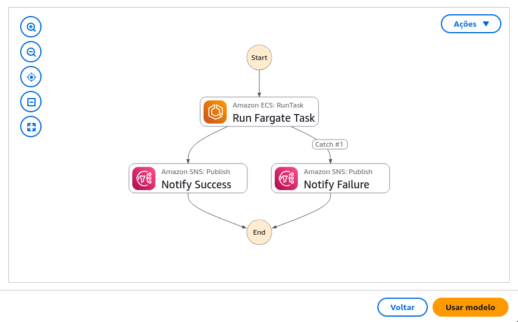

# Guia Prático: Orquestração de Tarefas ECS (Fargate) com Notificação SNS

Este documento descreve um caso de uso prático para a automação de tarefas em contêineres usando o AWS Step Functions, garantindo que o resultado da operação seja notificado via Amazon SNS.

## 1. Objetivo do Projeto

Demonstrar a capacidade do AWS Step Functions de **orchestrar de forma síncrona** a execução de tarefas no AWS Fargate (serviço de contêineres gerenciado do Amazon ECS). O fluxo de trabalho aguarda a conclusão da tarefa e, em seguida, dispara uma notificação personalizada (via SNS) sobre o sucesso ou falha da execução.

## 2. Arquitetura e Componentes Envolvidos

O projeto utiliza um padrão de integração síncrona onde o Step Functions atua como o **maestro** do processo.

| Componente | Função no Projeto |
| :--- | :--- |
| **AWS Step Functions (State Machine)** | O "Maestro" do processo. Define a ordem de execução e a lógica de notificação. |
| **Amazon ECS (Fargate)** | Executa a tarefa em contêiner (o trabalho principal a ser feito). |
| **Amazon SNS** | Serviço de mensageria para enviar notificações por e-mail, SMS, ou HTTP após a conclusão da tarefa. |
| **AWS CloudFormation** | Usado para provisionar e configurar todos os recursos necessários de forma automatizada. |

## 3. Detalhamento do Fluxo de Trabalho (State Machine)

A State Machine implementa um padrão de integração chamado **"Run a Job"** (Executar um Trabalho), que faz com que o Step Functions aguarde o resultado final da tarefa ECS antes de prosseguir.

### Fluxo Lógico

1.  **Início:** O fluxo é iniciado com parâmetros que definem a tarefa ECS.
2.  **Executar Tarefa ECS:** O Step Functions chama o serviço ECS e monitora ativamente a execução do contêiner até o fim.
3.  **Verificar Resultado:**
    * **Sucesso:** Se a tarefa for concluída com êxito, o Step Functions avança para a etapa de notificação de sucesso.
    * **Falha:** Se a tarefa falhar (erro no contêiner ou tempo limite), o fluxo avança para a etapa de notificação de falha.
4.  **Notificação SNS:** Envia uma mensagem personalizada para o tópico SNS, informando o resultado final do trabalho (êxito ou falha).
5.  **Fim.**

### Representação Visual 

## 4. Guia de Implementação Rápida (Baseado em Modelos AWS)

A AWS disponibiliza *templates* (modelos) de projetos prontos que facilitam a criação e o teste deste cenário:

### 4.1. Criação da State Machine

1.  Acesse o **Console do AWS Step Functions** e selecione a opção para **Criar Máquina de Estado**.
2.  Na tela de seleção, escolha a opção **"Criar a partir de um modelo"** (ou *Create from template*).
3.  Localize e selecione o modelo inicial que corresponde ao gerenciamento de tarefas de contêineres com ECS/Fargate.

### 4.2. Escolha do Modo de Uso

Ao usar o modelo, escolha a opção que melhor se adapta à sua necessidade:

* **Opção A: Rodar uma Demonstração (Modo Rápido)**
    * **Finalidade:** Ideal para aprendizado e testes rápidos.
    * **Ação:** Implanta uma State Machine já funcional, pronta para rodar, junto com todos os recursos auxiliares (cluster Fargate e tópico SNS).

* **Opção B: Personalizar e Desenvolver (Modo Avançado)**
    * **Finalidade:** Ideal para uso em projetos existentes.
    * **Ação:** Fornece apenas o código JSON editável da State Machine, permitindo que você a adapte ao seu ambiente (usando seus próprios Lambdas, clusters ECS e tópicos SNS).

### 4.3. Implantação e Execução

1.  Se você escolheu o **Modo Rápido (Demonstração)**, clique em **Implantar e Executar**.
2.  Aguarde a conclusão do processo de criação da CloudFormation.
3.  Assim que a opção **Iniciar Execução** estiver disponível, revise os dados de entrada (JSON) e clique para iniciar o fluxo.

